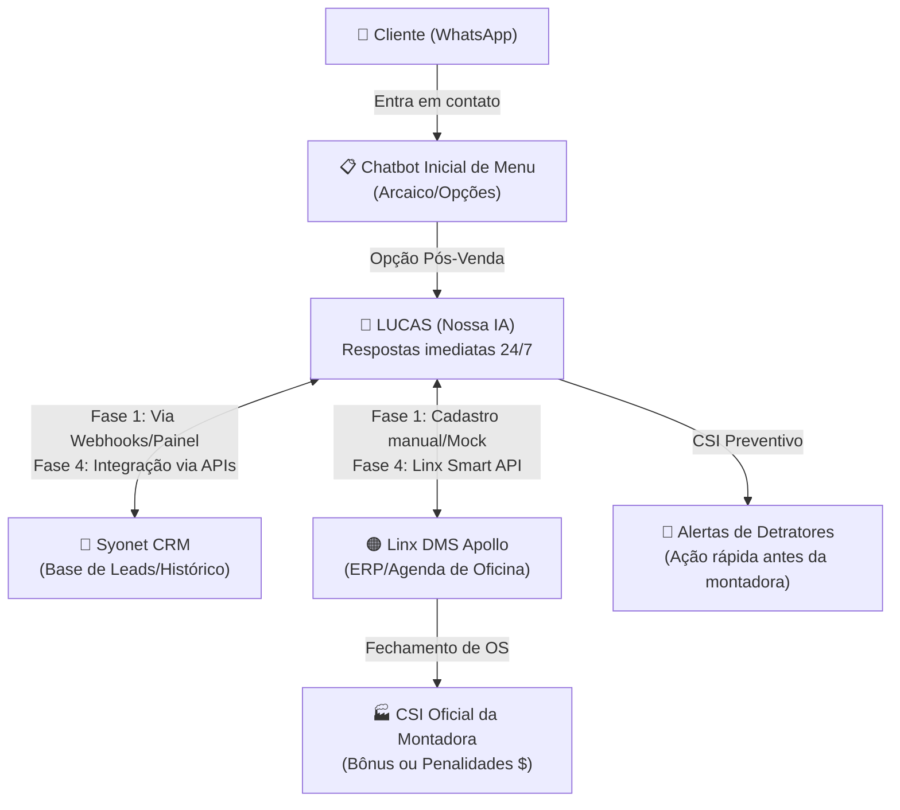

# PLAN-orletti-atendimento.md

> **Projeto:** Agente de Atendimento e Pós-Venda (Lucas) — Grupo Orletti  
> **Status:** 🟡 Planejamento (Atualizado com alinhamentos pós-apresentação)  
> **Data:** 30/06/2026

---

## 📋 Visão Geral (Overview)

Este plano detalha a implementação do **Lucas**, o assistente virtual de Pós-Venda do **Grupo Orletti**. 

O projeto nasceu para resolver uma dor crítica do grupo: a **perda de leads no WhatsApp** devido à demora de resposta humana (que hoje chega a dias) e à insatisfação com o chatbot de menu convencional da **Syonet** (visto como rígido e arcaico).

O Lucas funcionará como uma **camada de inteligência conversacional avançada**. Ele será acionado assim que o cliente escolher a opção de Pós-Venda/Agendamento no menu inicial do WhatsApp, realizando agendamentos e conduzindo pesquisas de satisfação de forma fluida, empática e natural.

---

## 🔄 Cenário de Integração e Sistemas

A concessionária opera com dois sistemas principais consolidados que precisam ser considerados:

### 1. Syonet CRM (Relacionamento)
*   **Papel atual:** Controla o funil de leads, marketing e relacionamento. Possui uma ferramenta de chatbot padrão de menu.
*   **Nossa abordagem:** O Lucas **não substitui** o canal da Syonet, mas assume a conversa no momento em que ela é direcionada para agendamentos. A IA nativa da Syonet não será utilizada por ser julgada arcaica e robótica.

### 2. Linx DMS Apollo (ERP/Operação)
*   **Papel atual:** Gerencia ordens de serviço (OS), estoque de peças, agenda física da oficina e faturamento. É a "fonte da verdade".
*   **Nossa abordagem:** Inicialmente (MVP), os agendamentos feitos pelo Lucas serão consolidados em nosso banco de dados (Supabase) e em um painel administrativo para inserção manual no Apollo. Na fase de integração, utilizaremos a **Linx Smart API** para inserção direta na agenda da oficina.

---

## 📊 Estratégia de CSI Preventivo (NPS)

O **CSI (Customer Satisfaction Index)** é uma métrica obrigatória da montadora com impacto financeiro direto (bônus ou penalidades nas margens da concessionária). 

O Lucas atuará como um **CSI Preventivo** através do seguinte fluxo:

1.  **Fechamento da OS:** O cliente realiza o serviço e a OS é encerrada no Apollo.
2.  **Pesquisa Conversacional:** O Lucas dispara uma pesquisa de satisfação interna via WhatsApp de forma amigável.
3.  **Detecção de Detratores:** Se o cliente der uma nota baixa ou apontar uma falha grave (ex: serviço mal feito, atraso na entrega), o Lucas gera um **alerta em tempo real** para a gerência da concessionária.
4.  **Resolução Proativa:** A concessionária entra em contato com o cliente para resolver o problema **antes** que a montadora realize a pesquisa de CSI oficial, protegendo a nota e os bônus do grupo.

---

## 🏗️ Fases de Implementação e Task Breakdown

### FASE 1 — Alinhamento e Definição Técnica (Foco na Próxima Reunião)
#### 🎯 Objetivos: Alinhamento de infraestrutura e viabilidade com a equipe de TI do Grupo Orletti.

- **T1.1 — Reunião Técnica de Integração**
  - Investigar disponibilidade de acesso à **Linx Smart API** (DMS Apollo) para leitura e escrita na agenda.
  - Investigar acesso às APIs da **Syonet** para envio de logs de conversas.
  - Identificar os responsáveis técnicos da TI do grupo e fluxos de homologação.
- **T1.2 — Definição do Escopo do Piloto**
  - Escolher **1 marca** (ex: Hyundai ou Fiat) e **1 unidade** (ex: Vila Velha) específica para rodar a primeira fase de testes práticos.
  - Mapear a grade de horários, consultores técnicos e serviços específicos da unidade escolhida.

---

### FASE 2 — Aprimoramento do MVP e Regras de Negócio
#### 🎯 Objetivos: Tornar o fluxo do Lucas 100% aderente às regras de pós-venda automotivo do grupo.

- **T2.1 — Lógica de Roteamento por Unidade e Marca**
  - Refinar o prompt e a lógica do backend para direcionar marcas específicas apenas para as unidades homologadas (ex: Peugeot apenas para Serra ou Vila Velha).
- **T2.2 — Regras Estritas de Restrição**
  - Validação rigorosa de ano do veículo (apenas $\ge$ 2015).
  - Validação estrita de horários de funcionamento (Seg-Sex das 07h40 às 18h00, Sáb das 08h00 às 12h00).
  - Redirecionamento amigável e restrito para vendas de veículos e peças de reposição (evitar que leads frios travem o bot de serviços).

---

### FASE 3 — Banco de Dados e Painel de Controle (Supabase + n8n)
#### 🎯 Objetivos: Garantir persistência de dados e painel para operação manual do piloto.

- **T3.1 — Schema de Banco de Dados (`migration_orletti.sql`)**
  - Estruturar tabelas `orletti_sessions` (controle de sessão), `orletti_conversations` (histórico de chat), `orletti_agendamentos` (dados dos agendamentos coletados) e `orletti_satisfaction` (pesquisa de satisfação interna/CSI preventivo).
- **T3.2 — Painel Operacional de Agendamentos (Dashboard)**
  - Criar views no Supabase ou painel simples para que a recepção da concessionária piloto visualize os agendamentos do Lucas e os insira manualmente no Linx Apollo.
- **T3.3 — Mecanismo de Alerta de Detratores**
  - Configurar trigger/n8n para enviar e-mail ou notificação interna na concessionária sempre que um feedback com nota insatisfatória for registrado na pesquisa de satisfação.

---

### FASE 4 — Integração via APIs (Fase Técnica)
#### 🎯 Objetivos: Automação completa eliminando intervenção manual.

- **T4.1 — Integração com a Agenda do Linx DMS Apollo**
  - Consumir a Linx Smart API para buscar horários disponíveis em tempo real.
  - Gravar o agendamento diretamente na agenda da oficina do Apollo após confirmação do cliente.
- **T4.2 — Integração de Clientes e Histórico no Syonet CRM**
  - Gravar o lead no funil de pós-venda da Syonet.
  - Sincronizar o histórico da conversa do WhatsApp com o cadastro do cliente no CRM.

---

### FASE 5 — Validação e Rollout do Piloto
#### 🎯 Objetivos: Testar em ambiente controlado e expandir.

- **T5.1 — Homologação e Simulações (Dry Run)**
  - Realizar baterias de testes simulando erros de horário, marcas antigas, troca de veículos na conversa e respostas à pesquisa de satisfação.
- **T5.2 — Lançamento do Piloto na Unidade Selecionada**
  - Ativar o redirecionamento do menu do WhatsApp da unidade para o fluxo do Lucas.
  - Acompanhar de perto o tempo de resposta, taxa de no-show e eficácia do CSI preventivo.

---

## 🎯 Critérios de Sucesso

1.  **Tempo de Resposta:** Resposta da IA enviada em menos de 3 segundos no WhatsApp.
2.  **Eficiência de Agendamento:** Clientes conseguem agendar sem qualquer intervenção humana.
3.  **Redução de Leads Perdidos:** Taxa de abandono por falta de resposta reduzida a próximo de zero.
4.  **CSI Protegido:** Identificação e alerta de 100% dos clientes insatisfeitos antes do envio da pesquisa da montadora.

---

## ⚠️ Riscos e Contramedidas

| Risco | Probabilidade | Impacto | Mitigação |
| :--- | :---: | :---: | :--- |
| **Bloqueios e lentidão de APIs de terceiros (Linx/Syonet)** | Média | Alto | Utilizar fila de mensagens no n8n e fallback para inserção manual via painel em caso de queda de API. |
| **Resistência da TI Corporativa para liberar credenciais** | Média | Alto | Apresentar compliance de LGPD rigoroso e iniciar com integração via planilhas/webhooks simples antes de acessar banco de dados direto. |
| **Clientes que tentam burlar regras de veículos antigos** | Baixa | Médio | Validação severa via IA no prompt do Lucas combinada com verificação da placa no banco de dados. |

---

*Próximo passo: Conduzir a reunião técnica (Fase 1 - T1.1) e validar as credenciais e acessos às APIs da Linx e Syonet.*
